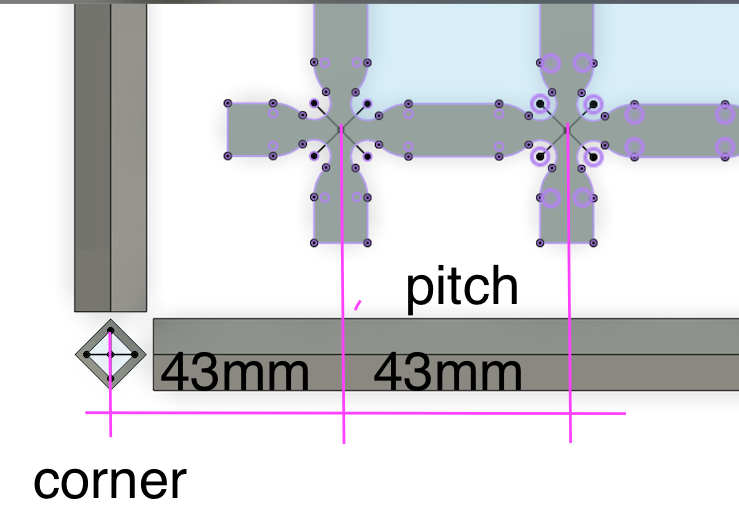
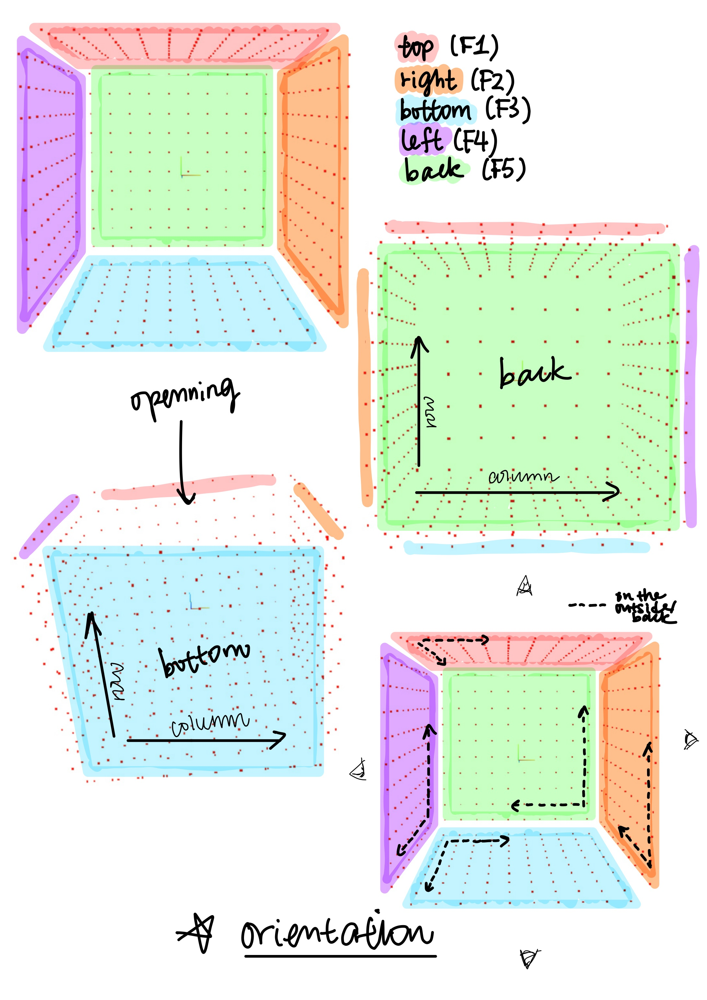
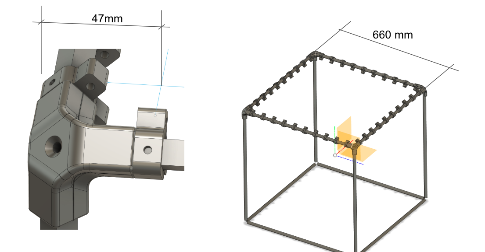

# Fabrication Notes

To start the development server, run:
```
npx vite
```

New fabrication setup:


Labeling of the faces and their orientations:


---

## Icebox

Specifications of Alfonso's setup:


